# Архитектура проекта

## Общий обзор

Notes API - это RESTful сервис для управления заметками, построенный с использованием современных практик разработки и архитектурных паттернов. Проект следует принципам чистой архитектуры и разделения ответственности.

## Архитектурные слои

### 1. API Layer (app/api/)

Отвечает за обработку HTTP-запросов и маршрутизацию. Использует FastAPI для создания эндпоинтов.

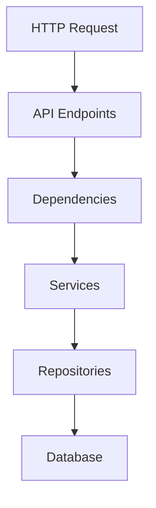

#### Компоненты:
- `endpoints/` - эндпоинты API
- `deps.py` - зависимости FastAPI
- `router.py` - маршрутизация API

### 2. Service Layer (app/services/)

Содержит бизнес-логику приложения. Каждый сервис отвечает за определенную область функциональности.

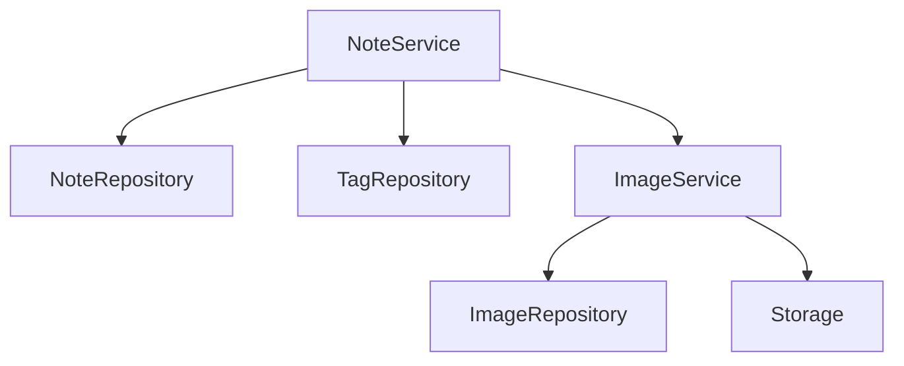

#### Основные сервисы:
- `NoteService` - управление заметками
- `TagService` - управление тегами
- `ImageService` - управление изображениями

### 3. Repository Layer (app/db/repositories/)

Абстракция над базой данных, реализующая паттерн Repository.

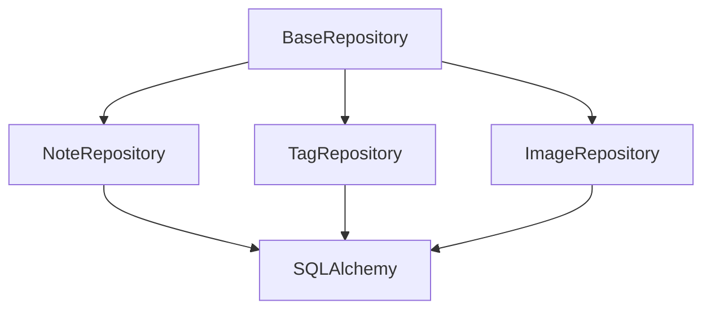

#### Особенности:
- Наследование от `BaseRepository`
- Типизация с помощью Generic
- Асинхронные операции

### 4. Domain Layer (app/models/, app/schemas/)

Определяет основные сущности и их взаимодействие.

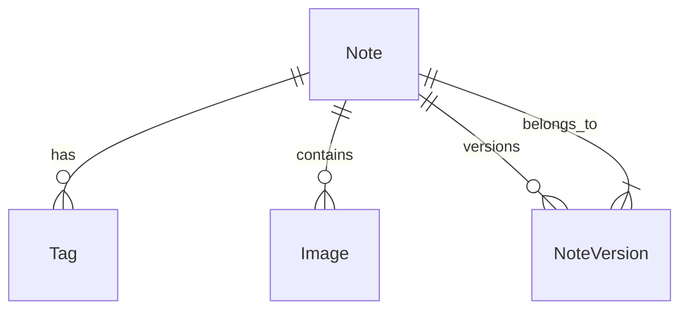

#### Модели:
- `Note` - заметка
- `Tag` - тег
- `Image` - изображение
- `NoteVersion` - версия заметки

#### Схемы:
- Pydantic модели для валидации
- Отдельные схемы для создания/обновления/ответа

### 5. Infrastructure Layer (app/storage/, app/core/)

Обеспечивает взаимодействие с внешними системами.

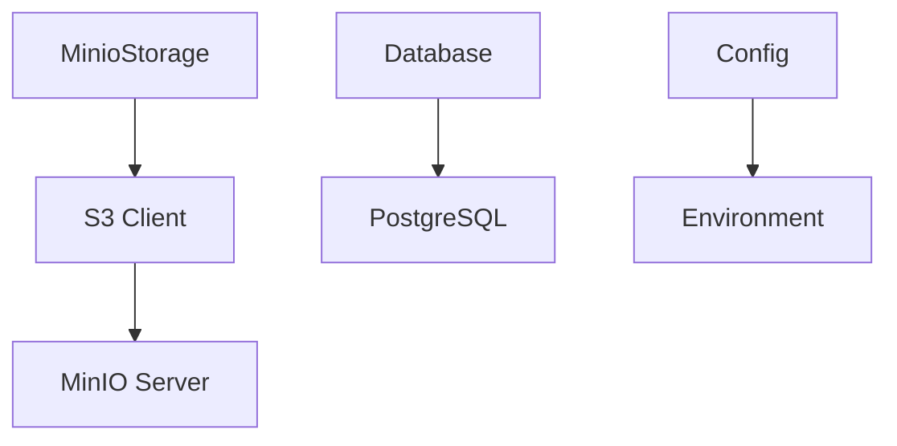

#### Компоненты:
- `MinioStorage` - работа с MinIO
- `Config` - конфигурация приложения
- `Database` - настройки базы данных

## Асинхронность

Проект использует асинхронное программирование для эффективной обработки запросов:

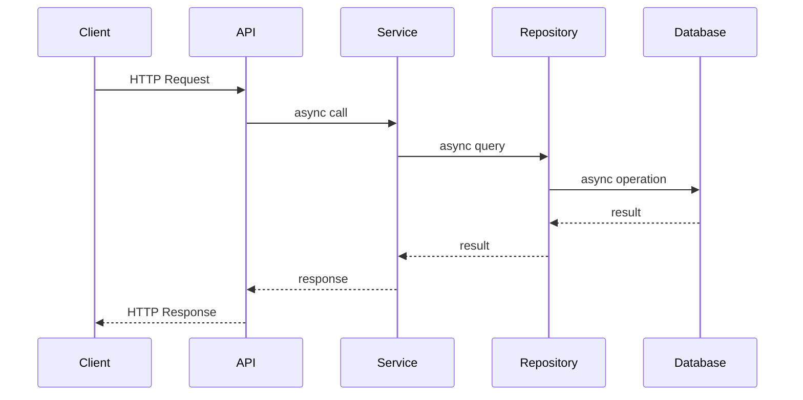

## Обработка ошибок

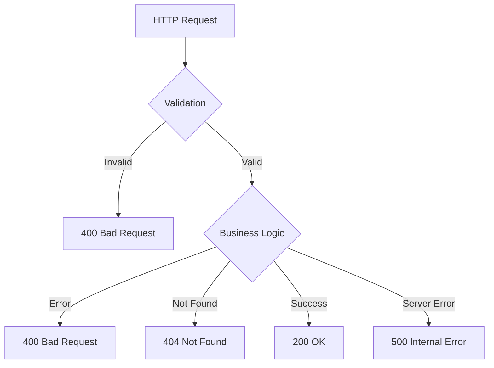

## Безопасность

### Аутентификация и авторизация

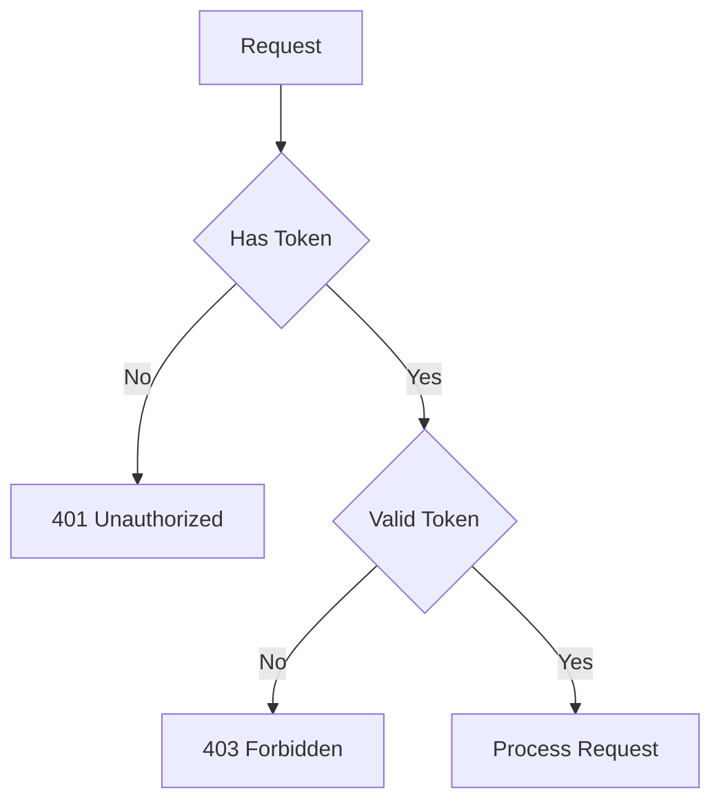

### Защита данных

1. Валидация входных данных
2. Параметризованные запросы
3. Безопасное хранение файлов
4. Логирование действий

## Масштабирование

### Горизонтальное масштабирование

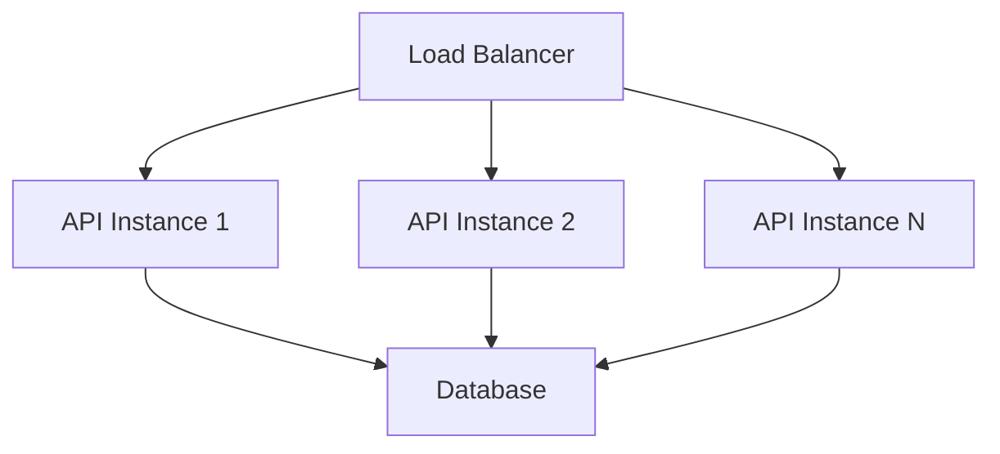

### Стратегии:

1. Репликация базы данных
2. Кэширование
3. Асинхронная обработка
4. Микросервисная архитектура (в будущем)

## Мониторинг

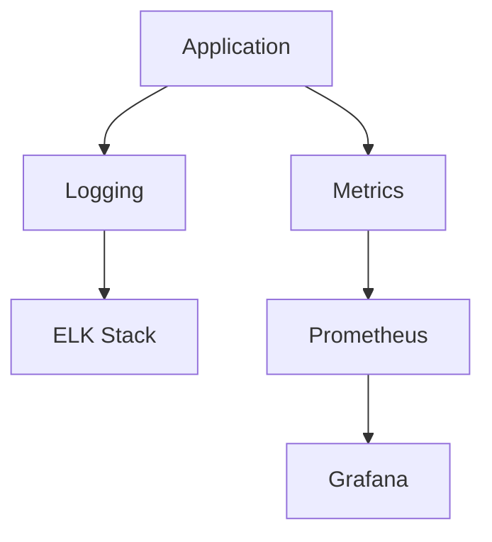

## Развертывание

### Docker Compose

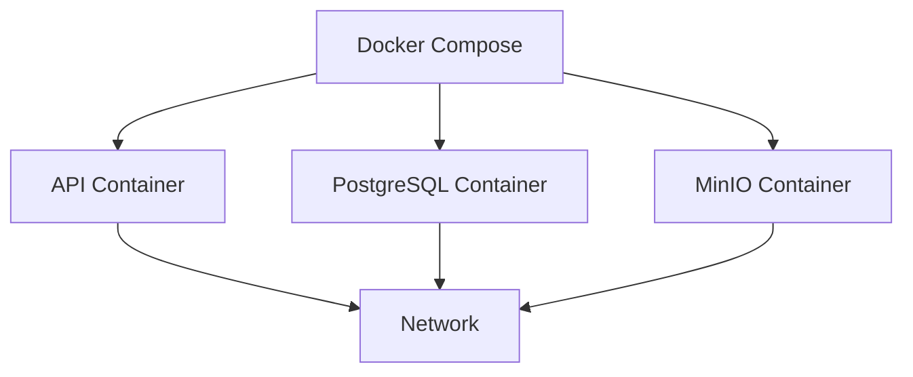

### CI/CD Pipeline

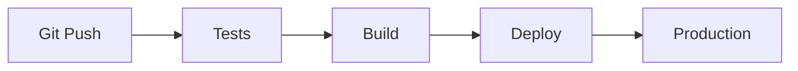

## Будущие улучшения

1. Микросервисная архитектура
2. Кэширование с Redis
3. Очереди сообщений (RabbitMQ)
4. Сервис поиска (Elasticsearch)
5. Мониторинг и алертинг
6. Контейнеризация с Kubernetes 